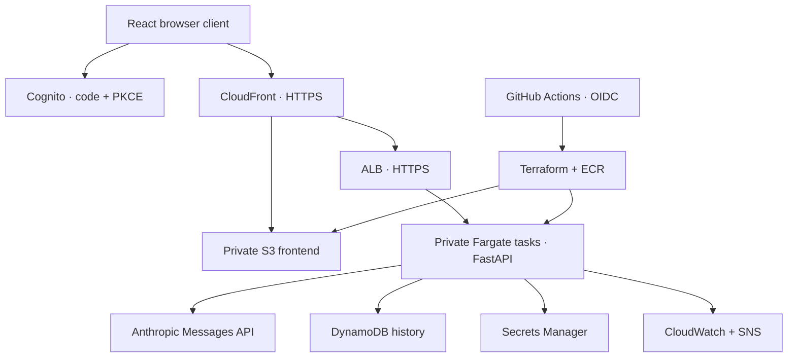

# Claude AWS DevOps Platform

A complete repository for a private Claude chatbot: React, FastAPI, streaming responses, Cognito authentication, DynamoDB history, ECS Fargate, Terraform, and GitHub Actions.

**Implementation status:** application and infrastructure code are provided with local verification recorded in [VALIDATION.md](docs/VALIDATION.md). No live AWS deployment or repository push has been performed. Deployment requires your AWS account, domain, Anthropic API key, and GitHub repository configuration. AWS and Anthropic usage are billable.



## Quick local start

Install Python 3.12, [uv](https://docs.astral.sh/uv/getting-started/installation/), and Node.js 24. From the repository root:

```bash
cp .env.example backend/.env
cd backend
uv sync --frozen --python 3.12
uv run uvicorn app.main:app --host 127.0.0.1 --port 8000 --reload --no-access-log
```

In a second terminal:

```bash
cd frontend
npm ci
npm run dev
```

Open [localhost:5173](http://localhost:5173). Demo mode has simulated replies, a single local user, and in-memory history that resets on restart. It does not contact AWS or Anthropic. Keep local servers bound to loopback.

For real local Claude replies, set `MOCK_CLAUDE=false` and add your key to the ignored `backend/.env`. Never place credentials in `VITE_*` variables. For deployed environments, the backend fetches the key directly from Secrets Manager.

## Included

- Streaming and JSON chat responses, bounded input/history, SDK retries, timeouts, and explicit stream errors.
- Tenant isolation, per-user rate limits, conditional conversation leases, and completed-request idempotency.
- React chat, PKCE sign-in, cancellation, retry, saved history, pagination, and deletion.
- Two-AZ VPC, private ECS tasks, ALB target TLS, Route 53/ACM origin TLS, CloudFront, and private S3.
- Encrypted storage, protected Terraform state with KMS and S3 locking, DynamoDB PITR, runtime IAM permissions boundaries.
- Immutable ECR images, CI tests/audits, Terraform PR plans, staged deployments, application rollback, and SNS notifications.
- CloudWatch dashboard, ALB health/error alarms, stream-error alarms, and VPC flow logs.

## Repository layout

| Path | Contents |
| --- | --- |
| `infra/` | Application Terraform, environment tfvars, provider lock |
| `infra/bootstrap/` | State bucket/KMS, ECR, empty secrets, SNS topics, GitHub OIDC and roles |
| `backend/` | FastAPI, Dockerfile, pinned dependencies and tests |
| `frontend/` | React/TypeScript, Cognito client, SSE parser and tests |
| `.github/workflows/` | CI, PR plan, release orchestration, reusable environment deploy |
| `scripts/` | Terraform initialization, verified release/rollback, secure key upload |
| `docs/` | Architecture, setup, operations, security and validation |

## Environment variables

| Variable | Local default | AWS behavior |
| --- | --- | --- |
| `APP_ENV` | `local` | Required: dev/staging/prod |
| `LOCAL_AUTH` | `false` unless .env copied | Must be false; true prevents startup |
| `MOCK_CLAUDE` | `false` unless .env copied | Must be false; true prevents startup |
| `AWS_REGION` | `eu-west-1` | Region for Cognito, DynamoDB and Secrets Manager |
| `ANTHROPIC_API_KEY` | Empty | Forbidden; use secret ARN |
| `ANTHROPIC_SECRET_ARN` | Empty | Secret containing `{"ANTHROPIC_API_KEY":"..."}` |
| `TABLE_NAME` | Empty, in-memory store | Environment DynamoDB table |
| `COGNITO_USER_POOL_ID` | Empty | Pool ID for JWT issuer/JWKS |
| `COGNITO_CLIENT_ID` | Empty | Only accepted OAuth client |
| `COGNITO_DOMAIN` | Empty | HTTPS managed login domain |
| `CLAUDE_MODEL` | `claude-haiku-4-5-20251001` | Configurable model available to your Anthropic account |
| `MAX_OUTPUT_TOKENS` | `1024` | Hard permitted range 1–4096 |
| `GENERATION_TIMEOUT` | `120` seconds | Maximum 120; JSON responses cap at 45 |
| `RETENTION_DAYS` | `30` | Set by environment tfvars |
| `CHAT_REQUESTS_PER_MINUTE` | `10` | Per authenticated user |
| `API_REQUESTS_PER_MINUTE` | `60` | Per authenticated user |
| `MAX_HISTORY_BYTES` | `100000` | Budget checked before each generation |
| `RELEASE_SHA` | `local` | Deployed Git commit, checked by release smoke test |

See [SETUP.md](docs/SETUP.md) for repository/environment variables and every deployment command.

## Deployment

1. Configure AWS CLI using SSO, choose your existing Route 53 domain, and publish this repository.
2. Apply `infra/bootstrap` once with a human operator's AWS SSO session, then migrate its state to S3.
3. Populate each environment's Anthropic secret using `scripts/set-secret.py`.
4. Configure GitHub variables, environments, deployment branch restrictions, reviewers, and notifications.
5. Push `dev` to run CI, build/scan/push an image and deploy dev. Open a PR to `main` for CI and read-only Terraform plans.
6. Merge the reviewed PR: main builds one backend image, pushes the same image to staging and production ECR repositories, deploys staging, then deploys prod through its configured environment approval gate.

Use the numbered [Setup Checklist](docs/SETUP.md#setup-checklist) for the full sequence. A first deployment provisions ongoing paid resources, including NAT gateways and ALBs. This is not a free-tier-only project.

## Tests

```bash
make test
cd frontend && npm run build
```

CI additionally validates Terraform, audits Python/npm dependencies, scans secrets and infrastructure, and scans the Docker image. Action references are pinned to verified commit SHAs. Review dependency updates, regenerate the Python lock/export together, and keep both Terraform provider locks committed.

## Contributing

Create a feature branch from `dev`, keep changes focused, add tests for behavior/security changes, run validation, and open a PR. Never commit credentials, Terraform state, saved plans, or local environment files. Dependency updates must include the appropriate lockfile. Use backward-compatible API and storage changes so application rollback remains safe.

Protect `main`: require a PR, at least one approval, the `validate` CI check, resolved conversations, and current branches; block force pushes and deletion. Enable CODEOWNERS review for workflow, infrastructure, and authentication changes as described in [SECURITY.md](docs/SECURITY.md).

Licensed under the [MIT License](LICENSE).
