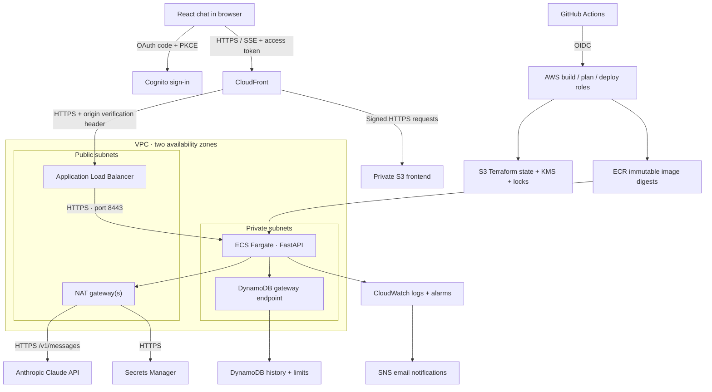

# Architecture

The application is an authenticated text chatbot. FastAPI uses the official Anthropic SDK against `https://api.anthropic.com/v1/messages`. Haiku 4.5 is the default to keep experiment costs manageable; `claude_model` is configurable. React uses a single origin, so production requires no permissive CORS configuration.

## Decisions

| Choice | Reason and tradeoff |
| --- | --- |
| FastAPI + ECS Fargate | Straightforward long-lived SSE connections and container operations; continuous AWS charges. |
| Two public and two private subnets | ALB spans two AZs; tasks have no public IPs. Dev shares one NAT; prod has a NAT per AZ. |
| S3 + CloudFront OAC | Private static assets with edge caching, HTTPS, and browser security headers. The S3 website endpoint is deliberately unused. |
| Public ALB with restricted ingress | CloudFront's managed prefix list plus a random verification header protect the origin. An ACM certificate authenticates origin TLS. |
| HTTPS targets | Each task generates its own certificate at startup. ALB encrypts this hop but does not authenticate target certificates. Network security groups restrict which targets it can reach. |
| Cognito code flow with PKCE | Public browser client with no client secret. API accepts verified access tokens, rejects ID tokens and wrong clients. |
| DynamoDB on demand | Conversations, leases and rate counters share a table, without database passwords or connection pooling. |
| Separate Terraform states | `dev/`, `staging/`, `prod/`; bootstrap is managed separately. No Terraform workspaces are required. |
| Private account invitation | Self-registration is disabled to control who can consume paid AI tokens. |

## Request and storage contract

1. The browser obtains an access token from Cognito using authorization code + PKCE. Tokens and refresh tokens live in memory; PKCE transaction state is temporarily stored in sessionStorage. Reloading requires signing in again, usually with an existing Cognito session.
2. CloudFront forwards `/api/*` without caching, including Authorization, and supplies the origin verification header. The ALB defaults to HTTP 403 for unmatched requests.
3. The API checks RS256 signatures, issuer, expiry, token type, OAuth client, and scope. The user's JWT `sub` becomes the only tenant identifier used in DynamoDB keys.
4. An atomic, per-user, per-minute counter bounds request volume. A conditional lease admits one active generation per conversation across all tasks.
5. The SDK retries transient failures before a stream begins. The API emits `delta`, `done`, and `error` SSE events, plus ten-second heartbeat comments. Once streamed output begins, the backend does not replay the stream.
6. Both messages are persisted together only after the final upstream response. A successful request ID can be replayed without another Claude call. Reusing it with different text returns HTTP 409. Interrupted/billed upstream calls cannot provide exactly-once billing guarantees.
7. On disconnect, generation is cancelled and the lease is released. A crash leaves a lease that expires after 240 seconds. A completion racing a disconnect may already have saved; the client rereads history and uses the same request ID.

| Item | Partition key | Sort key | Lifetime |
| --- | --- | --- | --- |
| Conversation | `USER#<JWT sub>` | `CONV#<UUID>` | Sliding retention since last completed turn |
| Rate counter | `RATE#<scope>#<JWT sub>` | UTC minute number | Two minutes, with delayed physical TTL cleanup |

Conversation history is a bounded JSON field in one item. Maximum 40 completed turns, 8,000 input characters per request, a 100 KB history/input budget before generation, and a 280 KB absolute serialized history limit keep items below DynamoDB's 400 KiB limit. Users start another conversation at the limit. Expired items are hidden immediately even when physical TTL deletion is delayed. List pagination is by UUID key order, not recency.

The default generation budget is 120 seconds for streaming and 45 seconds for nonstreaming responses. The shorter JSON budget stays inside CloudFront's 60-second first-byte/read timeout. API request bodies are limited to 40,000 bytes, including chunked uploads.

## Environment defaults

| Setting | dev | staging | prod |
| --- | --- | --- | --- |
| Fargate tasks, minimum / maximum | 1 / 3 | 1 / 3 | 2 / 6 |
| vCPU / memory per task | 0.25 / 512 MiB | 0.25 / 512 MiB | 0.5 / 1 GiB |
| NAT gateways | 1 | 1 | 2 |
| WAF IP rate rule | Off | On | On |
| History retention | 7 days | 14 days | 30 days |
| ALB, Cognito and DynamoDB deletion protection | Off | Off | On |

These environments are separate resources in one AWS account by default. They are not hard security boundaries: selected infrastructure creation/read APIs cannot be fully restricted by resource name. Use separate accounts and organization controls before treating production as isolated from development administrators.

## Sources

Design references checked September 7, 2026:

- [Anthropic model identifiers](https://platform.claude.com/docs/en/models/overview).
- [Official Anthropic Python SDK](https://github.com/anthropics/anthropic-sdk-python).
- [Errors during streaming](https://platform.claude.com/docs/en/api/errors).
- [Restricting ALB access to CloudFront](https://docs.aws.amazon.com/AmazonCloudFront/latest/DeveloperGuide/restrict-access-to-load-balancer.html).
- [ALB HTTPS targets and certificate behavior](https://docs.aws.amazon.com/elasticloadbalancing/latest/application/load-balancer-target-groups.html).
- [GitHub OIDC with AWS](https://docs.github.com/actions/deployment/security-hardening-your-deployments/configuring-openid-connect-in-amazon-web-services).
